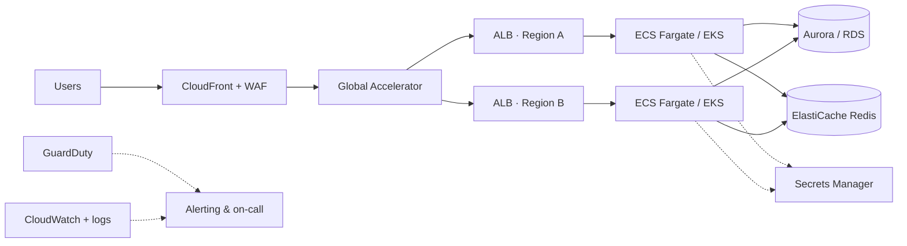

<p align="center">
  <a href="https://www.thecloudventures.com/about">
    
  </a>
</p>

<p align="center">
  <a href="https://www.linkedin.com/in/anupam091"></a>
  <a href="https://www.thecloudventures.com"></a>
  <a href="https://cal.com/cloudventures/30min"></a>
  <a href="https://github.com/thecloudventures"></a>
</p>

<p align="center">
  <b>Jump to:</b>
  <a href="#-about-me">About</a> ·
  <a href="#-at-a-glance">At a glance</a> ·
  <a href="#-career-journey">Journey</a> ·
  <a href="#-selected-work">Selected work</a> ·
  <a href="#-how-i-build">How I build</a> ·
  <a href="#-tech-stack">Stack</a> ·
  <a href="#-ways-to-work-together">Work together</a> ·
  <a href="#-contact">Contact</a>
</p>

---

## 👋 About me

I'm **Anupam**, a cloud and DevOps engineer with **10+ years** of hands-on experience building, running, and securing production infrastructure — and the founder of **[Cloud Ventures](https://www.thecloudventures.com)**.

My career started on the Linux command line: patching servers, debugging outages at 3 a.m., and learning that reliable systems are designed, not hoped for. Over the past decade that grew into designing multi-region AWS platforms, automating everything with Terraform and CI/CD, and owning production for teams that can't afford downtime.

In **2024** I founded Cloud Ventures to give startups and growing companies what large enterprises take for granted: a senior cloud team that designs it properly, documents it, and stays on call — without the cost of hiring a full operations department.

> **What I care about:** systems that are boring in production, infrastructure anyone on the team can understand, and cloud bills that make sense.

---

## 📊 At a glance

| | |
|---|---|
| 🧑‍💻 **Experience** | 10+ years in DevOps, cloud infrastructure & Linux |
| 🏅 **Certification** | AWS Certified DevOps Engineer – Professional |
| 🏢 **Role** | Founder & Principal Cloud Engineer, Cloud Ventures (since 2024) |
| 🌍 **Live regions I operate** | `ap-south-1` · `us-east-1` · `us-east-2` · `eu-west-2` |
| ☁️ **Clouds** | AWS (primary) · Azure · Google Cloud |
| 🕐 **Time zones covered** | US · UK/EU · UAE · India — with 24×7 on-call |
| 📍 **Based in** | Chandigarh / Mohali, India |

---

## 🧭 Career journey

```text
 Linux & systems  ──►  DevOps & automation  ──►  Cloud architecture  ──►  Founder, Cloud Ventures
 ───────────────       ───────────────────       ──────────────────       ───────────────────────
 Server admin,         CI/CD pipelines,          Multi-region AWS,        Delivery lead for client
 patching, shell       Docker, config mgmt,      ECS/EKS, Terraform,      platforms, 24×7 managed
 scripting, uptime     release automation        security & cost work     ops, compliance readiness
```

| Phase | Focus | What I took from it |
|---|---|---|
| **Linux & systems** | Server administration, OS upgrades, troubleshooting, monitoring | Deep debugging instincts and respect for production |
| **DevOps & automation** | CI/CD, containers, configuration management | If you do it twice, automate it |
| **Cloud architecture** | AWS multi-account, multi-region, IaC, security, FinOps | Design for failure, cost, and the next engineer |
| **Founder** | Leading delivery, client architecture reviews, managed ops | Clear scope, honest advice, ownership of outcomes |

---

## 🛠️ Selected work

Representative engagements — client names withheld for confidentiality.

<details open>
<summary><b>🌍 Multi-region production platform on AWS</b></summary>
<br>

- Run production workloads across **four AWS regions** for SaaS, fintech, and ticketing products
- Stack: **EC2 + Auto Scaling + ALB**, **ECS Fargate**, **RDS / Aurora**, **ElastiCache Redis**, **CloudFront**, **Global Accelerator**
- Secrets in **Secrets Manager**, threat detection with **GuardDuty**, everything defined in **Terraform**
- Ongoing ownership: scaling, incidents, patching, cost reviews

</details>

<details>
<summary><b>🛡️ WAF cost optimisation & bot detection</b></summary>
<br>

- Audited **AWS WAF** rule groups and **Bot Control** usage on a high-traffic platform
- Re-scoped expensive managed rules to the paths that actually need them
- Tuned bot-detection rules to block bad traffic without hurting real users
- Result: lower WAF spend with equal or better protection

</details>

<details>
<summary><b>📈 Centralised logging & log shipping</b></summary>
<br>

- Designed log-shipping pipelines from application and infrastructure sources into a central store
- Structured logs, sensible retention, and alerting tied to user impact rather than noise

</details>

<details>
<summary><b>📧 Email deliverability (Amazon SES)</b></summary>
<br>

- Diagnosed SES delivery problems end-to-end: **SPF, DKIM, DMARC**, bounce and complaint handling, reputation
- Fixed DNS and sending configuration so transactional mail reliably lands in inboxes

</details>

<details>
<summary><b>🐧 Fleet-wide Ubuntu upgrades (20.04 → 26.04)</b></summary>
<br>

- Planned and executed sequential **in-place Ubuntu LTS upgrades** across production environments
- Pre-checks, snapshots, staged rollout, and rollback plans — zero surprises in production

</details>

<details>
<summary><b>🔒 Security framework & incident response</b></summary>
<br>

- Authored a **security framework specification** for a SaaS / consumer platform
- Investigated and cleaned up a **compromised WordPress site** (malicious iframe redirects), then hardened it

</details>

<details>
<summary><b>💾 Off-site backup automation</b></summary>
<br>

- Automated weekly backups from a **Windows Server VM** to **S3-compatible object storage (Wasabi)**
- Scheduled sync, retention, and restore testing

</details>

---

## 🧱 How I build

A typical production setup I design and run:



**Principles I follow on every engagement**

| Principle | In practice |
|---|---|
| 🧾 **Everything as code** | Terraform for infra, pipelines for every deploy — no click-ops in production |
| 🧯 **Design for failure** | Multi-AZ by default, multi-region where it matters, tested backups and restores |
| 🔐 **Secure by default** | Least-privilege IAM, secrets never in code, WAF and GuardDuty from day one |
| 💰 **Cost is a feature** | Rightsizing, autoscaling, and regular bill reviews — not a year-end surprise |
| 📚 **Leave it documented** | Runbooks, diagrams, and handover so your team can own it |
| 🗣️ **Honest advice** | I'll tell you when you *don't* need Kubernetes |

---

## ⚙️ Tech stack

| Area | Tools |
|---|---|
| ☁️ **Cloud** |     |
| 📦 **Compute & containers** | EC2 · Auto Scaling · ALB / NLB · ECS Fargate · EKS ·   |
| 🗄️ **Data** | RDS · Aurora · ElastiCache Redis · S3 · backups & DR |
| 🌐 **Edge & networking** | CloudFront · Global Accelerator · Route 53 · VPC design · Transit / peering |
| 🔐 **Security** | AWS WAF & Bot Control · GuardDuty · Secrets Manager · IAM · KMS · hardening |
| 🧱 **IaC** |  · CloudFormation |
| 🔁 **CI/CD** |   · CodePipeline · GitOps |
| 📈 **Observability** | CloudWatch · centralised logging · dashboards · alerting & on-call |
| 📧 **Messaging & email** | Amazon SES (SPF / DKIM / DMARC, bounce handling) |
| 🐧 **OS & scripting** |  Ubuntu · Amazon Linux · Windows Server ·   |

---

## 🚀 What I help with

| Service | What you get |
|---|---|
| ☁️ **Cloud migration** | Assessment, wave planning, low-downtime cutover, post-migration tuning |
| 🧱 **Landing zones & IaC** | Multi-account AWS foundations and reusable Terraform modules |
| ☸️ **Kubernetes & containers** | Production-ready EKS or ECS Fargate with autoscaling and observability |
| 🔁 **CI/CD & platform** | Pipelines with security gates, GitOps, self-service for developers |
| 🛡️ **Security & compliance** | Hardening, WAF, GuardDuty, readiness for SOC 2 · ISO 27001 · HIPAA · PCI DSS · DPDP |
| 💰 **Cost optimisation** | Idle-resource cleanup, rightsizing, commitment strategy, WAF/CDN tuning |
| 📟 **24×7 managed ops** | Monitoring, patching, incident response, monthly reviews |

---

## 🤝 Ways to work together

| 1️⃣ Free scoping call | 2️⃣ Fixed-price project | 3️⃣ Managed operations |
|:-:|:-:|:-:|
| 30 minutes · we look at your setup and goals | Written scope and price · 2–6 weeks · IaC + runbooks + handover | Optional retainer · 24×7 monitoring, patching, incidents, cost reviews |
| [Book now →](https://cal.com/cloudventures/30min) | [See modules →](https://www.thecloudventures.com/modules) | [Managed ops →](https://www.thecloudventures.com/services/managed-cloud-support) |

**Free tools:** 📊 [Cloud Readiness Scorecard](https://www.thecloudventures.com/assessment) (3 minutes, no email) · 💸 [Free cloud cost audit](https://www.thecloudventures.com/contact?intent=cost-audit)

---

## 📝 Latest writing

| Article | Topic |
|---|---|
| [Production-Ready Amazon EKS with Terraform: A Complete Guide](https://www.thecloudventures.com/blog/production-ready-amazon-eks-terraform) | Kubernetes |
| [AI DevOps: Shipping GenAI Features Safely to Production](https://www.thecloudventures.com/blog/ai-devops-secure-genai-pipelines) | AI DevOps |
| [AWS Organizations Landing Zone: A Practical Checklist](https://www.thecloudventures.com/blog/aws-organizations-landing-zone-checklist) | AWS |

➡️ More on the [Cloud Ventures blog](https://www.thecloudventures.com/blog)

---

## ❓ FAQ

<details>
<summary><b>Do you work with small teams and startups?</b></summary>
<br>
Yes — most clients are startups and growing SaaS teams without a dedicated ops team. Engagements start small and scale with you.
</details>

<details>
<summary><b>Which time zones can you cover?</b></summary>
<br>
I work with clients in the US, UK/EU, UAE and India, with overlap hours for calls and 24×7 coverage for managed operations.
</details>

<details>
<summary><b>AWS only, or Azure and GCP too?</b></summary>
<br>
AWS is my primary platform and certification. Cloud Ventures also delivers on Azure and Google Cloud.
</details>

<details>
<summary><b>Can you take over an existing setup?</b></summary>
<br>
Yes. I start with an audit of architecture, security and cost, then document and stabilise before changing anything.
</details>

---

## 📫 Contact

| | |
|---|---|
| 🏢 **Company** | [Cloud Ventures](https://www.thecloudventures.com) · [GitHub org](https://github.com/thecloudventures) |
| 💼 **LinkedIn** | [linkedin.com/in/anupam091](https://www.linkedin.com/in/anupam091) |
| 📧 **Email** | [enquiry@thecloudventures.com](mailto:enquiry@thecloudventures.com) |
| 📞 **Phone** | [+91 98166 97440](tel:+919816697440) |
| 💬 **WhatsApp** | [Chat with me](https://wa.me/919816697440?text=Hi%20Anupam%2C%20I'd%20like%20to%20discuss%20a%20cloud%20project.) |
| 📅 **Book a call** | [cal.com/cloudventures/30min](https://cal.com/cloudventures/30min) |
| 📍 **Location** | Chandigarh / Mohali, India · remote worldwide |

<p align="center">
  
</p>

<p align="center"><sub>Need help with cloud infrastructure? Free 30-minute scoping call — you leave with a clear next step and a written price.</sub></p>
